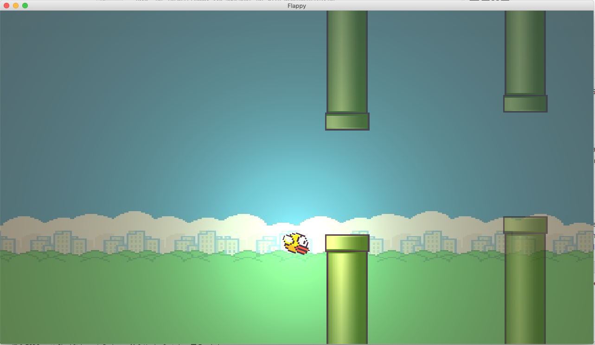

# Flappy

Following along with https://github.com/TheCherno/Flappy

# Build

## Run

## Generic
- `java -jar target/flappy-1.0-SNAPSHOT-jar-with-dependencies.jar`

### MacOS
- `java -XstartOnFirstThread -jar target/flappy-1.0-SNAPSHOT-jar-with-dependencies.jar`

## Setup in IDE
- add `-Djava.library.path=target/natives`
- add `-XstartOnFirstThread` if on MacOS
- add `-ea` to enable assertions (gl error checking)

